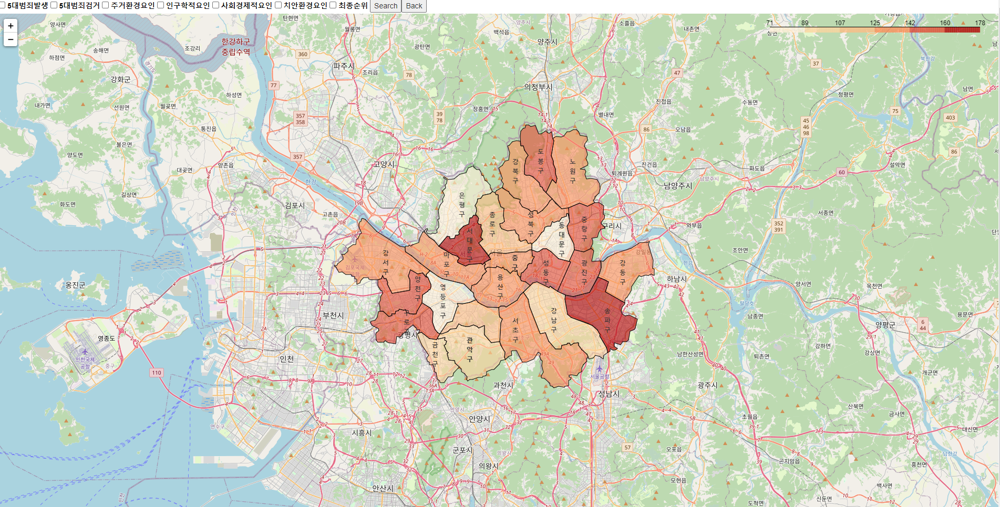
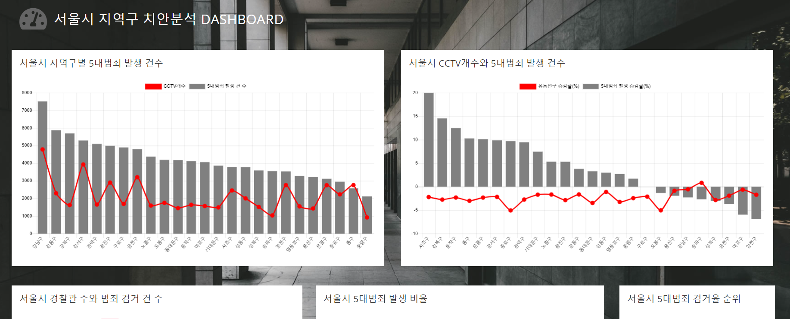
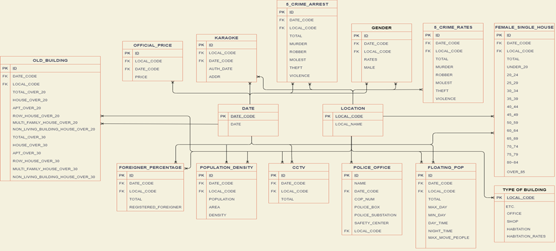
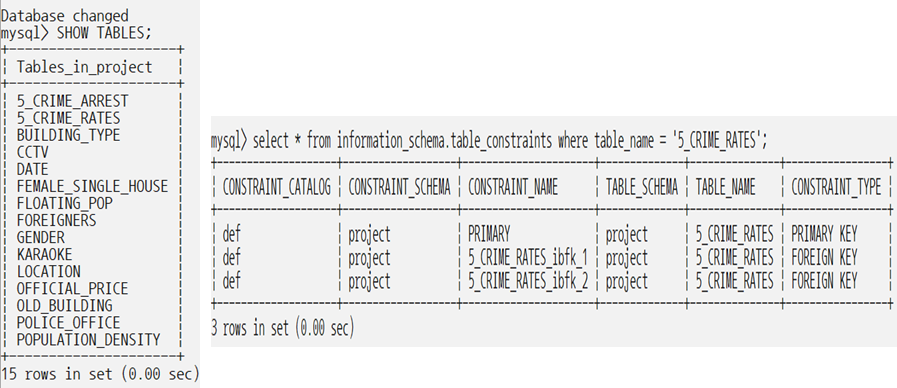

## 문제해결을 위한 빅데이터 활용 프로젝트

## Description

- 서울시 지역구별 치안 요인 분석을 위한 학습 데이터 구축 및 시각화
 (논문 탐색을 통해 치안 수준과 유관한 변수를 선정)

***
## ***Skill***

  
<!--  -->

  
  

  
  

  

  

  
<!--    -->

  
<!--    -->

  

  

## ***Role***

- 빅데이터포털,서울 열린데이터광장 등의 사이트에서 치안 관련 공공 데이터 크롤링
- Spark를 사용하여 데이터 전처리
- Matplotlib,Folium을 사용하여 수집 정보 시각화
- Mysql에 Database구축
- AWS 개발 환경 구축
- Django 기반의 결과 웹 페이지 구축

# ***Outputs***

### **1. Django로 구현한 결과 페이지**                   

##### 서울시 지역구 치안 수준 지도 시각화

​    
[Page Link](http://13.209.117.128:8000) | [Source Code Link](https://github.com/ankiyong/safety_project/tree/master/5.D_jango/data_django)
​    

### **2. 데이터 시각화**

  ##### 수집한 데이터로 dashboard를 만들어 시각화 진행

   [DashboardLink](http://13.209.117.128:8000/dash)
 
 
    

### **2. 최종 ERD 및 DB Schema**

​	

| **출처**            | **데이터이름**       | **제공형태** | **요약**                          |
| :------------------ | :------------------- | :----------- | --------------------------------- |
| 서울특별시          | 서울시 건축물 정보   | 크롤링       | 서울시 건축물 정보 현황(611908x5) |
| 공공데이터 포털     | 서울시 5대 범죄      | CSV          | 서울시 5대 범죄 현황(79x14)       |
| 공공데이터 포털     | 서울시 cctv          | CSV          | 서울시 CCTV 현황(26x13)           |
| 공공데이터 포털     | 서울시 노후 건물     | CSV          | 서울시 건물 노후 현황(80x14)      |
| 공공데이터 포털     | 서울시 경찰관        | API          | 서울시 경찰관 현황(11x4)          |
| 공공데이터 포털     | 서울시  치안센터     | API          | 서울시 치안센터 현황(275x2)       |
| 공공데이터 포털     | 서울시 파출소        | API          | 서울시 파출소 현황(116x3)         |
| 서울 열린데이터광장 | 서울시 외국인        | API          | 서울시 외국인 현황(81x13)         |
| 서울 열린데이터광장 | 서울시 유동인구      | API          | 서울시 유동인구 현황(16199x14)    |
| 서울 열린데이터광장 | 서울시 유흥업소      | CSV          | 서울시 유흥업소 현황(4877x25)     |
| 서울 열린데이터광장 | 서울시 인구밀도      | CSV          | 서울시 인구밀도 현황(75x5)        |
| 서울 열린데이터광장 | 서울시 공시지가      | API          | 서울시 공시지가 현황(376x3)       |
| 서울 열린데이터광장 | 서울시 여성 1인 가구 | CSV          | 서울시 여성 1인 가구 현황(234x19) |
| KOSIS(국가통계포털) | 서울시 성비          | CSV          | 서울시 성비 현황(28x11)           |

> 인용논문: 범죄율을 통해 살펴본 공공재의 보완성
>
> ​				 1인 가구와 범죄발생 관한 연구
>
> ​				 범죄예방환경설계(CPTED) 가이드라인
>
> ​				 범죄 분야 지역안전지수 산출방식에 관한 연구
