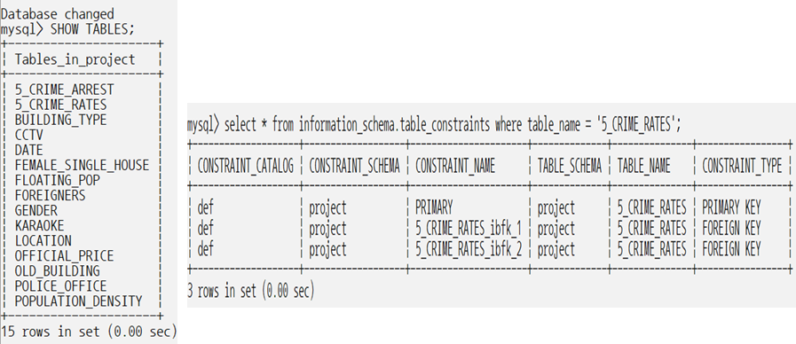
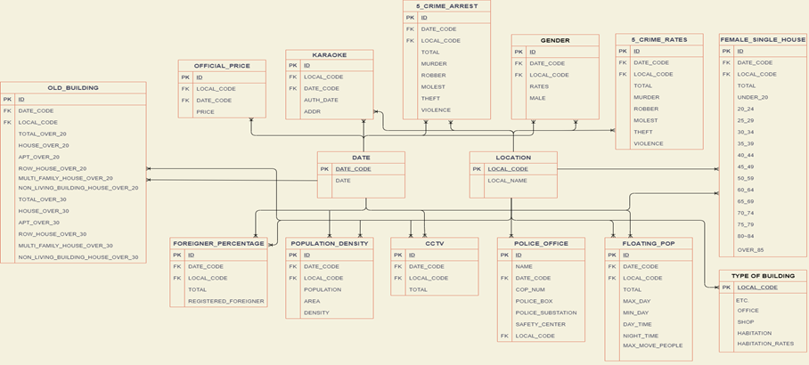

## 문제해결을 위한 빅데이터 활용 프로젝트

#### 1.Project

- 서울시 지역구별 치안 요인 분석

#### 2. Description

- 지역 치안에 영향을 주는 요인을 바탕으로 서울시 지역구별 치안 수준 분석을 위한 학습데이터를 구축하고 시각화

#### 3. Role

- 서울시 치안 관련 데이터 크롤링
- 데이터 전처리
- 수집 정보 시각화
- Database구축
- AWS 개발 환경 구축
- 결과 웹 페이지 구축

#### 4. Skill

- Python
- Spark
- Hadoop
- Django
- AWS
- Bs4
- Pandas
- Matplotlib
- Folium

#### 5. Outputs

​	

| **출처**            | **데이터이름**       | **제공형태** | **요약**                          |
| :------------------ | :------------------- | :----------- | --------------------------------- |
| 서울특별시          | 서울시 건축물 정보   | 크롤링       | 서울시 건축물 정보 현황(611908x5) |
| 공공데이터 포털     | 서울시 5대 범죄      | CSV          | 서울시 5대 범죄 현황(79x14)       |
| 공공데이터 포털     | 서울시 cctv          | CSV          | 서울시 CCTV 현황(26x13)           |
| 공공데이터 포털     | 서울시 노후 건물     | CSV          | 서울시 건물 노후 현황(80x14)      |
| 공공데이터 포털     | 서울시 경찰관        | API          | 서울시 경찰관 현황(11x4)          |
| 공공데이터 포털     | 서울시  치안센터     | API          | 서울시 치안센터 현황(275x2)       |
| 공공데이터 포털     | 서울시 파출소        | API          | 서울시 파출소 현황(116x3)         |
| 서울 열린데이터광장 | 서울시 외국인        | API          | 서울시 외국인 현황(81x13)         |
| 서울 열린데이터광장 | 서울시 유동인구      | API          | 서울시 유동인구 현황(16199x14)    |
| 서울 열린데이터광장 | 서울시 유흥업소      | CSV          | 서울시 유흥업소 현황(4877x25)     |
| 서울 열린데이터광장 | 서울시 인구밀도      | CSV          | 서울시 인구밀도 현황(75x5)        |
| 서울 열린데이터광장 | 서울시 공시지가      | API          | 서울시 공시지가 현황(376x3)       |
| 서울 열린데이터광장 | 서울시 여성 1인 가구 | CSV          | 서울시 여성 1인 가구 현황(234x19) |
| KOSIS(국가통계포털) | 서울시 성비          | CSV          | 서울시 성비 현황(28x11)           |

> 인용논문: 범죄율을 통해 살펴본 공공재의 보완성
>
> ​				 1인 가구와 범죄발생 관한 연구
>
> ​				 범죄예방환경설계(CPTED) 가이드라인
>
> ​				 범죄 분야 지역안전지수 산출방식에 관한 연구

FInal web_page: 

Django : http://52.197.177.14:8000/

zeppelin: http://52.197.177.14:8982/#/notebook/2GGKC7UGV

jupyter: http://52.197.177.14:8911/login?next=%2Fnotebooks%2Fseoul_crime_info.ipynb

